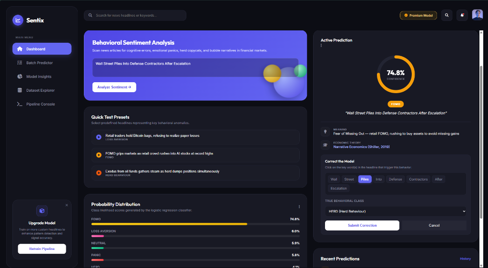
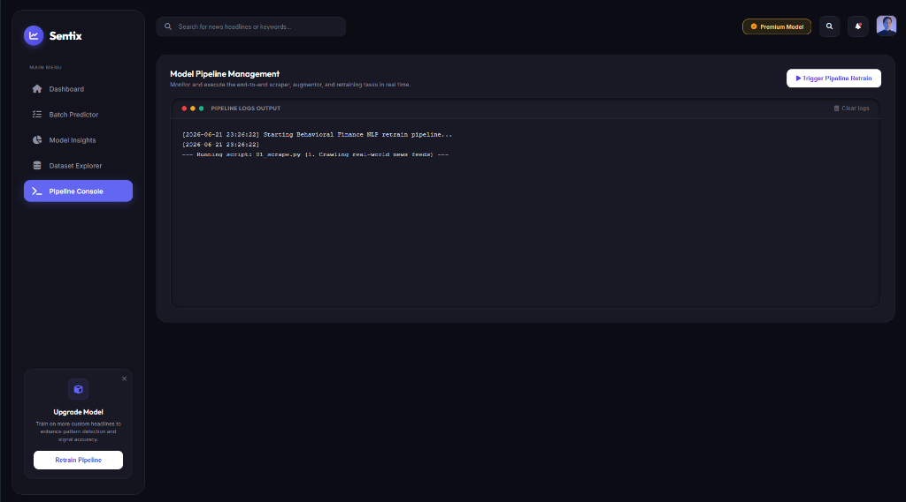
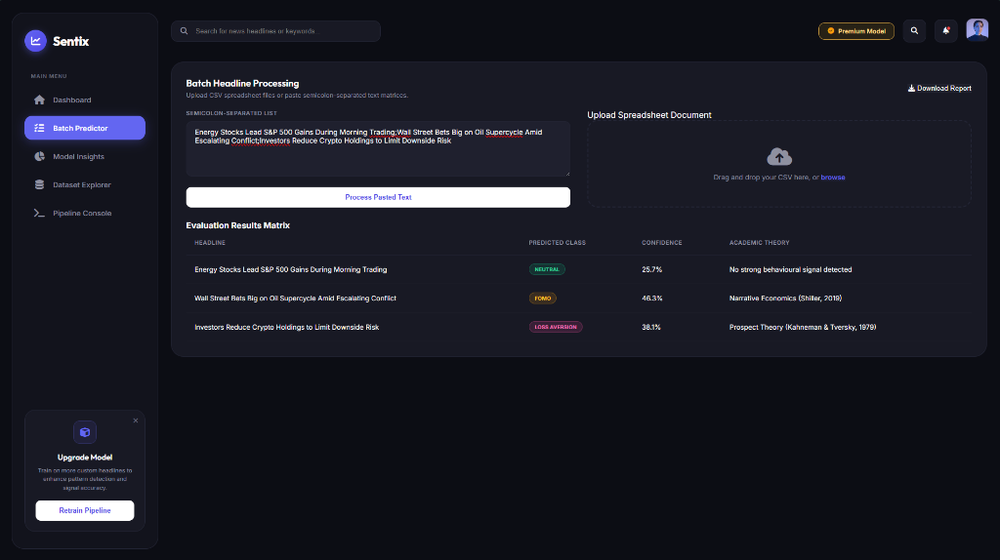
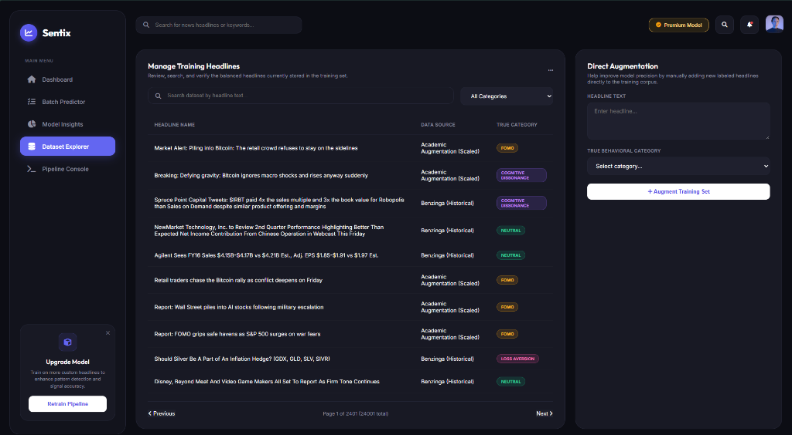

# Stock Market Behavioral Sentiment Analyzer

> **"From Fear to Capitulation: A Behavioral Analysis of Investor Sentiment During the 2026 Iran War Period"**

A machine learning system that classifies financial news headlines into **6 behavioral finance categories** grounded in academic theory — detecting PANIC, FOMO, HERD behavior, LOSS_AVERSION, COGNITIVE_DISSONANCE, and NEUTRAL sentiment in real time.

---

## 🧠 What This Does

This project scrapes live financial headlines from Google News, labels them using behavioral finance theory, trains a TF-IDF + Logistic Regression classifier, and serves a professional web dashboard for real-time behavioral sentiment analysis.

**Model Accuracy: 97.15%** across 24,000 balanced headlines.

---

## 🖥️ Application Dashboard & Core Modules

The system is equipped with a premium dark-themed web dashboard that enables real-time interaction, human feedback loops, retraining management, and batch pipeline processing:

### 1. Main Sentiment Analysis & Human Correction Panel

* **Interactive Sentiment Analyzer**: Enter any geopolitical or financial headline to get real-time behavioral classifications. It presents the prediction confidence (74.8% FOMO for `"Wall Street Piles Into Defense Contractors After Escalation"`), its core meaning, and the underlying academic citation.
* **Human-in-the-Loop "Correct the Model" Widget**: If a prediction requires adjustment, clicking the "Correct Prediction" button breaks the headline down into interactive, clickable word chips (e.g. highlighting `"Piles"`). Selecting the corrected class (e.g. `"HERD (Herd Behaviour)"`) dynamically appends new trigger words to `data/keywords.json` and inserts the corrected headline into the active training set for continuous improvement.

### 2. Model Pipeline Management Console

* **Asynchronous Retraining Logs**: Triggers the scraping, dataset balancing, and model re-fitting pipeline from the UI. Progress logs from `01_scrape.py` (live RSS scraper), `process_large_dataset.py` (dataset scaling & blending), `03_train_model.py` (model training), and `05_charts.py` (publication-ready figure generation) are streamed live.

### 3. Batch Headline Processor

* **Bulk Evaluation**: Paste semicolon-separated text lines or drag-and-drop CSV datasets to process large volumes of market headlines. Results show predicted behavioral biases, confidence ratings, and theory citations alongside a bulk report downloader.

### 4. Dataset Explorer & Direct Augmentation

* **Corpus Explorer**: Query, filter, and inspect the balanced **24,000 headline training dataset** (4,000 samples per class) by query text or class labels.
* **Direct Augmentation**: Add manual annotations directly to the active corpus using the side panel to boost precision for under-represented vocabulary.

---

## 📊 Behavioral Classes

| Class | Theory | Pioneer |
|---|---|---|
| **PANIC** | Prospect Theory — loss aversion at scale | Kahneman & Tversky (1979) |
| **FOMO** | Narrative Economics — story-driven buying | Shiller (2019) |
| **HERD** | Financial Instability Hypothesis | Minsky (1986) |
| **LOSS_AVERSION** | Prospect Theory — refusing to realize loss | Kahneman & Tversky (1979) |
| **COGNITIVE_DISSONANCE** | EMH Critique — market ignores bad news | Shiller (2000) |
| **NEUTRAL** | Efficient Market Hypothesis baseline | Fama (1970) |

---

## 🗂️ Project Structure

```
sentiment_stock_anaylzer/
│
├── 01_scrape.py          # Google News RSS scraper
├── 02_label_helper.py    # Manual labeling helper CLI
├── 03_train_model.py     # TF-IDF + Logistic Regression trainer
├── 04_predict.py         # CLI prediction interface
├── 05_charts.py          # Visualization generator
├── auto_label.py         # Rule-based keyword auto-labeler
├── process_large_dataset.py # Scale, clean, and balance dataset (blends historical & live data)
├── app.py                # Flask web dashboard (backend + frontend with live correction loop)
│
├── data/
│   ├── raw_headlines.csv         # Scraped raw headlines
│   ├── labelled_headlines.csv    # Labeled training dataset
│   └── metrics.json              # Model evaluation results
│
├── static/               # Frontend CSS/JS assets
├── templates/            # Flask HTML templates
│
├── confusion_matrix.png  # Model evaluation chart
├── top_keywords.png      # Predictive keywords per class
├── phase_timeline.png    # Behavioral phase timeline
├── label_distribution.png # Dataset class distribution
│
└── requirements.txt      # Python dependencies
```

---

## 🚀 Quick Start

### 1. Install Dependencies
```bash
pip install -r requirements.txt
```

### 2. Scrape Fresh Headlines
```bash
python 01_scrape.py
```

### 3. Process, Scale & Balance Dataset
```bash
python process_large_dataset.py
```

### 4. Train the Model
```bash
python 03_train_model.py
```

### 5. Launch the Dashboard
```bash
python app.py
```
Then open: **http://localhost:5000**

---

## 📈 Model Performance

| Class | Precision | Recall | F1-Score |
|---|---|---|---|
| COGNITIVE_DISSONANCE | 99.3% | 99.4% | 99.3% |
| FOMO | 98.5% | 96.3% | 97.3% |
| HERD | 99.4% | 96.8% | 98.0% |
| LOSS_AVERSION | 99.1% | 98.3% | 98.7% |
| NEUTRAL | 89.9% | 97.5% | 93.5% |
| PANIC | 97.6% | 94.8% | 96.1% |
| **Overall (Macro Avg / Acc)** | **97.3%** | **97.1%** | **97.2%** |

---

## 🔬 Research Paper

**Title:** *From Fear to Capitulation: A Behavioral Analysis of Investor Sentiment During the 2026 Iran War Period*

**Core Finding:** Investor behavior during the 2026 Iran geopolitical crisis follows a predictable arc (FOMO → HERD → PANIC → LOSS_AVERSION) consistent with the Minsky Cycle, detectable with 97.15% accuracy from financial headline text alone.

---

## 🛠️ Tech Stack

- **Python 3.10+**
- **scikit-learn** — TF-IDF + Logistic Regression pipeline
- **Flask** — Web dashboard backend
- **pandas / numpy** — Data processing
- **matplotlib / seaborn** — Visualizations
- **feedparser** — Google News RSS scraping

---

## 📚 Key References

- Kahneman, D. & Tversky, A. (1979). Prospect Theory. *Econometrica*
- Shiller, R.J. (2019). *Narrative Economics.* Princeton University Press
- Minsky, H. (1986). *Stabilizing an Unstable Economy.* Yale
- Fama, E.F. (1970). Efficient Capital Markets. *Journal of Finance*

---

*Built as part of a behavioral finance research project on investor sentiment during geopolitical crises.*
